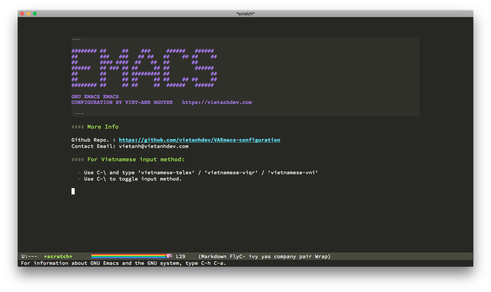

~~~
######## ##     ##    ###     ######   ######
##       ###   ###   ## ##   ##    ## ##    ##
##       #### ####  ##   ##  ##       ##
######   ## ### ## ##     ## ##        ######
##       ##     ## ######### ##             ##
##       ##     ## ##     ## ##    ## ##    ##
######## ##     ## ##     ##  ######   ######
~~~

# EMACS EDITOR - CONFIGURATION BY VIET-ANH NGUYEN

[https://vietanhdev.com](https://vietanhdev.com)

#### Some packages inside:

- Theme: monokai
- Autocomplete: helm, company, yasnippet, autopair
- Realtime error checking: flycheck
- UX: sumlimity, neotree, all-the-icons

#### Installation:

~~~ bash
rm -r ~/.emacs.d
rm ~/.emacs
git clone https://github.com/vietanhdev/VAEmacs-configuration.git ~/.emacs.d
~~~

#### If you want to re-install all the packages (not recommended):

- Delete `~/.emacs.d/elpa/` folder.

~~~ bash
rm -r ~/.emacs.d/elpa/
~~~

- Open Emacs, `M-x` type `package-install <RET> use-package <RET>`, wait for `use-package` to be installed.
- Restart Emacs and wait for other packages to be installed.
- Restart Emacs again and enjoy.

#### For Vietnamese input method:

- Use C-\ and type ‘vietnamese-telex‘ / ‘vietnamese-viqr‘ / ‘vietnamese-vni‘ .
- Use C-\ to toggle input method.

#### Screenshot

